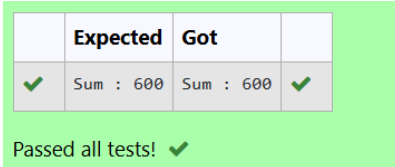

# File Handling in Python: Count Lines Not Starting with 'T'
## NAME: SANTHOSH T
## REG NO: 212223220100


## 🎯 Aim
To write a Python program that counts the number of lines in a text file `story.txt` that do **not** start with the alphabet `'T'`.

## 🧠 Algorithm
1. Open the file `story.txt` in **read mode**.
2. Initialize a counter `count` to zero.
3. Iterate through each line of the file:
   - Check if the first character of the line is **not** `'T'`.
   - If the line does not start with `'T'`, increment the `count` by 1.
4. After processing all lines, print the `count` value, which represents the number of lines that do not start with `'T'`.

## 🧾 Program
```py
def returnSum(myDict):
    final=0
    for i in myDict.values():
        final+=i
    return final
#driver functions

myDict = {'a': 100, 'b': 200, 'c': 300}
print("Sum :",returnSum(myDict))
```

## Output


## Result
Thus,the program has been executed successfully.
